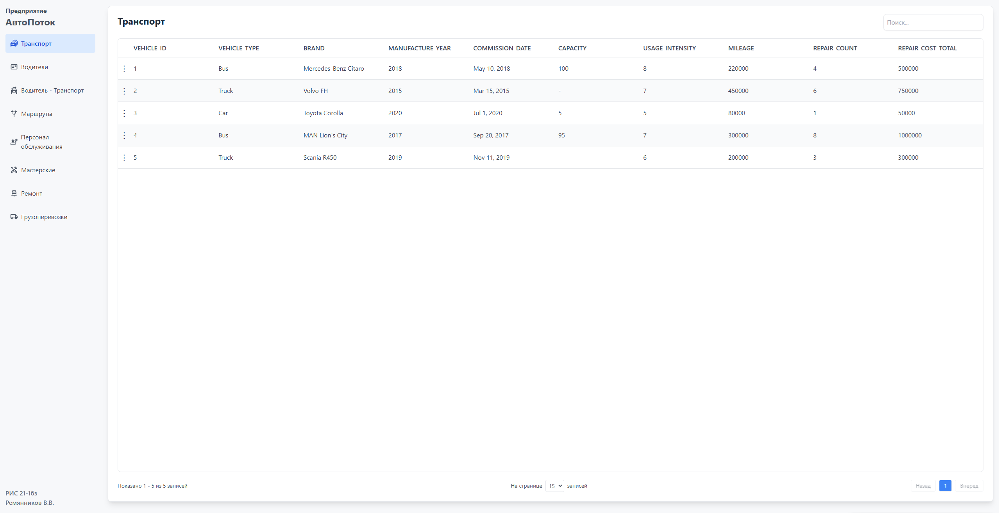

## Клиентская часть приложения

Клиентская часть программного обеспечения реализована с использованием библиотеки React.js. Данный фреймворк выбран за счёт своей высокой популярности, удобства компонентной архитектуры и широкой экосистемы. Интерфейс пользователя построен в виде веб-приложения, что обеспечивает доступность и кроссплатформенность системы.

### Визуальные компоненты системы

  
  

    Рис. 1 - Основной интерфейс системы
  

  
  

    Рис. 2 - Модальное окно для вывода результатов запросов
  

